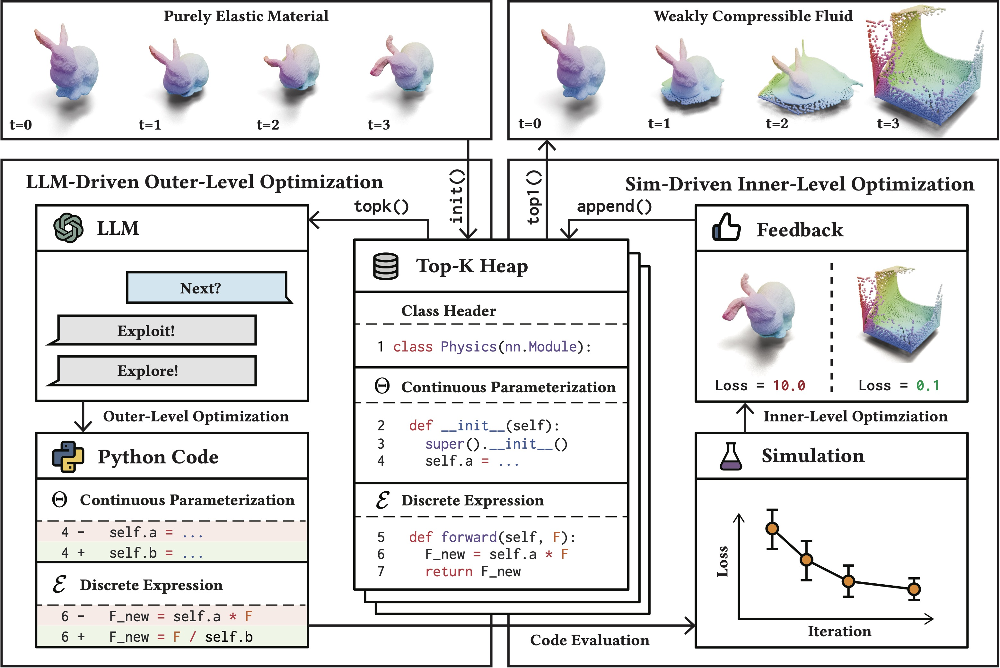

# Scientific Generative Agent

[](https://arxiv.org/abs/2405.09783)

<div align="center">

**Tl;dr: We propose a bilevel optimization framework for physical scientific discovery where (1) LLMs optimize the discrete scientific hypothesis and (2) physical simulations optimize the continuous parameters.**



</div>

## Getting Started

### Prerequisites

This codebase is built upon the following environment:

- Ubuntu 22.04
- CUDA 12.1
- GCC 11
- Python 3.10.14
- PyTorch 2.1.2

Although it is not guaranteed, the codebase should work on other versions of the above dependencies. Please make sure you have NVIDIA GPU with CUDA support and Internet connection.

### Installation

Clone the repository:

```bash
git clone https://github.com/PingchuanMa/SGA.git
cd SGA
```

Prepare anaconda environment and activate it:

```bash
conda create -n sga python=3.10
conda activate sga
```

Install the dependencies:

```bash
pip install -r requirements.txt
```

### Dataset Preparation

You can either (1) download the dataset from [[link]](https://drive.google.com/file/d/1uzOUtxmPF7c4J2DIYBG2WbltTrT-PPfN/view?usp=sharing) and extract it at `experiment/log/dataset` or (2) generate it by yourself:

```bash
python experiment/script/dataset/dataset_elasticity.py
python experiment/script/dataset/dataset_plasticity.py
```

### Training

First set up the global API key for the LLM you want to use if you haven't done so:

```bash
export OPENAI_API_KEY=your-api-key # for OpenAI
export ANTHROPIC_API_KEY=your-api-key # for Anthropic
export MISTRAL_API_KEY=your-api-key # for Mistral
```

Otherwise, you can set up a project-wise API key in the configuration files in `sga/config/llm`.

We provide a few example LLM services in the codebase:

- `openai-gpt-4-1106-preview`
- `openai-gpt-3.5-turbo-0125`
- `mistral-open-mixtral-8x7b`
- `anthropic-claude-3-sonnet-20240229`

Choose one of them and train the model by running the following command:

```bash
llm=openai-gpt-4-1106-preview # or other backbones
python experiment/script/physics/invent_neohookean_from_linear.py --llm ${llm}
python experiment/script/physics/invent_plasticine_from_identity.py --llm ${llm}
python experiment/script/physics/invent_sand_from_identity.py --llm ${llm}
python experiment/script/physics/invent_water_from_identity.py --llm ${llm}
```

### Customization

To use another LLM model, you can add the configuration in `sga/config/llm` and modify the `llm` argument in the training script. Please make sure the API key is set up correctly. You can also introduce other LLM providers by implementing the corresponding `BaseResponseData` class and `send_message` branch in `sga/agent/physicist.py` file.

To learn from other constitutive laws, you can implement the ground-truth constitutive law in `sga/config/physics/env/physics/templates` folder, add the corresponding configuration file in `sga/config/physics/env/physics` folder, re-generate the dataset, and modify the `dataset_path` argument in the training script.

## Citation

Please consider citing our work if you are using our codebase.

```tex
@inproceedings{ma2024llm,
  title={LLM and Simulation as Bilevel Optimizers: A New Paradigm to Advance Physical Scientific Discovery},
  author={Ma, Pingchuan and Wang, Tsun-Hsuan and Guo, Minghao and Sun, Zhiqing and Tenenbaum, Joshua B and Rus, Daniela and Gan, Chuang and Matusik, Wojciech},
  booktitle={International Conference on Machine Learning},
  year={2024},
  organization={PMLR}
}
```
